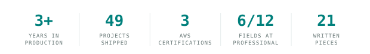
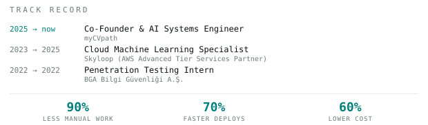
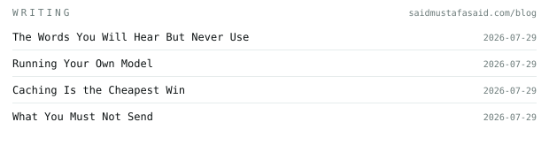
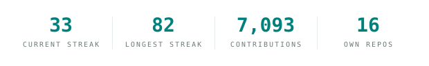

<picture><source media="(prefers-color-scheme: dark)" srcset="assets/dark/header.svg"/></picture>

**Said Mustafa Said** · AI/ML &amp; Cloud Engineer · Berlin, Germany

[saidmustafasaid.com](https://saidmustafasaid.com)
&nbsp;·&nbsp;
[about](https://saidmustafasaid.com/about)
&nbsp;·&nbsp;
[resume](https://saidmustafasaid.com/resume)
&nbsp;·&nbsp;
[writing](https://saidmustafasaid.com/blog)
&nbsp;·&nbsp;
[linkedin](https://www.linkedin.com/in/said-mustafa-said/)
&nbsp;·&nbsp;
[email](mailto:contact@saidmustafasaid.com)

<picture><source media="(prefers-color-scheme: dark)" srcset="assets/dark/figures.svg"/></picture>

<picture><source media="(prefers-color-scheme: dark)" srcset="assets/dark/hd-now.svg"/></picture>

I build AI systems end to end, then run them on the infrastructure they need.
Multi agent RAG, LLM orchestration, ML pipelines and MLOps, on Kubernetes and
AWS. Three years of that in production, mostly Go, Python and Terraform.

Right now I am building **myCVpath**, an AI CV platform, and **CONDUCKS**, which
reads a codebase as a graph instead of as text. Both are live and both are
private.

That last word is the honest part. Almost all of my work sits in closed
repositories, so counting public code would measure the small leftover and call
it a person. The field map below measures the work itself.

<picture><source media="(prefers-color-scheme: dark)" srcset="assets/dark/hd-shipped.svg"/></picture>

<samp>python &nbsp; go &nbsp; typescript &nbsp; rust &nbsp; kubernetes &nbsp; terraform &nbsp; aws &nbsp; eks &nbsp; docker &nbsp; postgres &nbsp; duckdb &nbsp; next.js &nbsp; linux</samp>

**[CONDUCKS](https://conducks.com)** &nbsp;·&nbsp; <samp>typescript, tree-sitter, duckdb</samp> 
Structural intelligence for codebases. Tree-sitter parses the source, DuckDB
holds the graph, PageRank ranks it. So "what calls this" and "what breaks if I
change it" are answered from the real call graph, not from a grep.

**[myCVpath](https://mycvpath.com)** &nbsp;·&nbsp; <samp>python, llm agents, mcp</samp> 
AI native CV intelligence. A multi agent pipeline reads a CV, reads a job
posting, scores the fit and rewrites the document. It speaks MCP, so an agent
can drive the whole run.

**[saidmustafasaid.com](https://saidmustafasaid.com)** &nbsp;·&nbsp; <samp>next.js, typescript</samp> 
The full record. Forty plus builds, each with its architecture diagram, plus a
course on applied AI engineering.

**[Free tools](https://saidmustafasaid.com/tools)** &nbsp;·&nbsp; <samp>go, python</samp> 
OCR and transcription, no signup. The public face of the internal media
services.

<picture><source media="(prefers-color-scheme: dark)" srcset="assets/dark/hd-fields.svg"/></picture>

<picture><source media="(prefers-color-scheme: dark)" srcset="assets/dark/fields.svg"/></picture>

Twelve fields, scored across forty plus real projects by an engine I wrote. Not
self reported.

The weak rows are the point. An assessment that hides MOBILE at zero is not
worth reading, and those rows are what make the high ones believable. I would
rather show you where I am thin than ask you to trust a wall of green.

<picture><source media="(prefers-color-scheme: dark)" srcset="assets/dark/hd-track.svg"/></picture>

<picture><source media="(prefers-color-scheme: dark)" srcset="assets/dark/track.svg"/></picture>

Three AWS certifications, up to DevOps Engineer Professional. I started in
penetration testing, which is why SECURITY scores where it does.

<picture><source media="(prefers-color-scheme: dark)" srcset="assets/dark/hd-writing.svg"/></picture>

<picture><source media="(prefers-color-scheme: dark)" srcset="assets/dark/writing.svg"/></picture>

I write to find out whether I actually understand something. If I cannot explain
it plainly, I do not know it yet.

<picture><source media="(prefers-color-scheme: dark)" srcset="assets/dark/hd-stats.svg"/></picture>

<picture><source media="(prefers-color-scheme: dark)" srcset="assets/dark/stats.svg"/></picture>

<picture><source media="(prefers-color-scheme: dark)" srcset="assets/dark/streak.svg"/></picture>

Every graphic here is drawn from my own data by
[a daily action](.github/workflows/stats.yml), so nothing on this page loads
from someone else's server. There is no language chart on purpose: GitHub counts
bytes in public repos, and my public repos are not the work.

