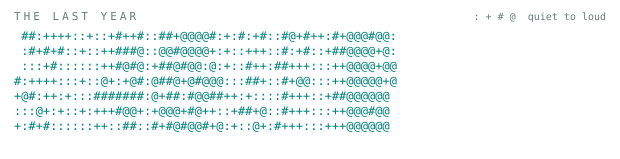

<picture><source media="(prefers-color-scheme: dark)" srcset="assets/dark/header.svg"/></picture>

**Said Mustafa Said** — AI/ML &amp; Cloud Engineer, Berlin, Germany.

[saidmustafasaid.com](https://saidmustafasaid.com)
&nbsp;·&nbsp;
[about](https://saidmustafasaid.com/about)
&nbsp;·&nbsp;
[resume](https://saidmustafasaid.com/resume)
&nbsp;·&nbsp;
[writing](https://saidmustafasaid.com/blog)
&nbsp;·&nbsp;
[linkedin](https://www.linkedin.com/in/said-mustafa-said/)
&nbsp;·&nbsp;
[email](mailto:contact@saidmustafasaid.com)

<picture><source media="(prefers-color-scheme: dark)" srcset="assets/dark/hd-about.svg"/></picture>

> AI/ML and cloud engineer in Berlin. Three-plus years in production. 
> Systems that survive contact with real traffic, not demos.

I build AI systems end to end — multi-agent RAG, LLM orchestration, ML pipelines
and MLOps — then run them on infrastructure I also own: Kubernetes, Terraform,
AWS. AWS Certified DevOps Engineer (Professional). Most of the work is private,
so the calendar below counts more than this account shows.

<picture><source media="(prefers-color-scheme: dark)" srcset="assets/dark/hd-stack.svg"/></picture>

<samp>python &nbsp; go &nbsp; typescript &nbsp; rust &nbsp; kubernetes &nbsp; terraform &nbsp; aws &nbsp; eks &nbsp; docker &nbsp; postgres &nbsp; duckdb &nbsp; next.js &nbsp; linux</samp>

<picture><source media="(prefers-color-scheme: dark)" srcset="assets/dark/hd-projects.svg"/></picture>

**[CONDUCKS](https://conducks.com)** &nbsp;·&nbsp; <samp>typescript, tree-sitter, duckdb</samp> 
Structural intelligence for codebases. Tree-sitter parses the source, DuckDB holds 
the graph, PageRank ranks it — so "what calls this" and "what breaks if I change 
it" come from the real call graph instead of from a grep.

**[myCVpath](https://mycvpath.com)** &nbsp;·&nbsp; <samp>python, llm agents, mcp</samp> 
AI-native CV intelligence. A multi-agent pipeline parses a CV, reads a job posting, 
scores the fit and tailors the document. Exposed over MCP, so an agent can drive 
the whole run end to end.

**[saidmustafasaid.com](https://saidmustafasaid.com)** &nbsp;·&nbsp; <samp>next.js, typescript</samp> 
The full record: thirty-plus AI, cloud and platform builds with architecture 
diagrams, plus a course-shaped blog on applied AI engineering.

**[Free tools](https://saidmustafasaid.com/tools)** &nbsp;·&nbsp; <samp>go, python</samp> 
OCR and transcription, no signup — the public face of the internal media services.

<picture><source media="(prefers-color-scheme: dark)" srcset="assets/dark/hd-stats.svg"/></picture>

<picture><source media="(prefers-color-scheme: dark)" srcset="assets/dark/stats.svg"/></picture>

<picture><source media="(prefers-color-scheme: dark)" srcset="assets/dark/streak.svg"/></picture>

<picture><source media="(prefers-color-scheme: dark)" srcset="assets/dark/langs.svg"/></picture>

longer windows

 

<picture><source media="(prefers-color-scheme: dark)" srcset="assets/dark/langs-3y.svg"/></picture>

<picture><source media="(prefers-color-scheme: dark)" srcset="assets/dark/langs-all.svg"/></picture>

<picture><source media="(prefers-color-scheme: dark)" srcset="assets/dark/year.svg"/></picture>

<picture><source media="(prefers-color-scheme: dark)" srcset="assets/dark/hd-colophon.svg"/></picture>

Every graphic here is generated, not embedded from anyone else's server. A
[scheduled action](.github/workflows/stats.yml) draws them straight from the GitHub
GraphQL API once a day and commits only what changed. Nothing on this page can
rate-limit or go dark, because nothing on this page loads from a third party.

They animate with SMIL inside the SVG, because GitHub strips scripts from READMEs.
The section headings are SVGs for the same reason: GitHub also strips CSS, so an
image is the only way to put this page's own type and colour on them. Each
animation ends on its finished state, so a renderer that ignores SMIL still shows
a complete graphic rather than an empty one.

The language card defaults to the **last 12 months** — what I am writing now ages
better than a lifetime total that only ever grows more stale. Longer windows are
behind the toggle. One honest caveat: GitHub's language API reports a repository's
CURRENT contents, with no history in it, so a window means "the repos I pushed to
in that period", not "the bytes I wrote in it".

Totals cover public, non-fork, non-archived repositories only — forks would drown
the signal. Notebooks and markup are excluded and no single repository may exceed
35% of a chart: a `.ipynb` stores every rendered plot as base64 inside the JSON, so
one coursework repo was briefly 88% of the chart while saying nothing about the
work. The contribution count includes private work where the account exposes it;
the repositories where most of the code lives are not public.

Said Mustafa Said · Berlin, Germany ·
[saidmustafasaid.com](https://saidmustafasaid.com) ·
[Said Foundation](https://github.com/Said-Foundation)

